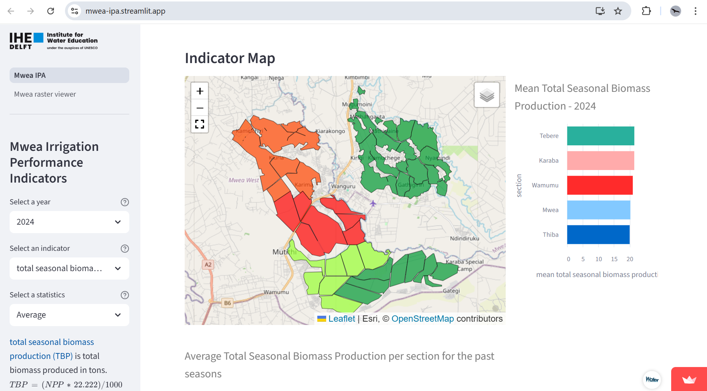
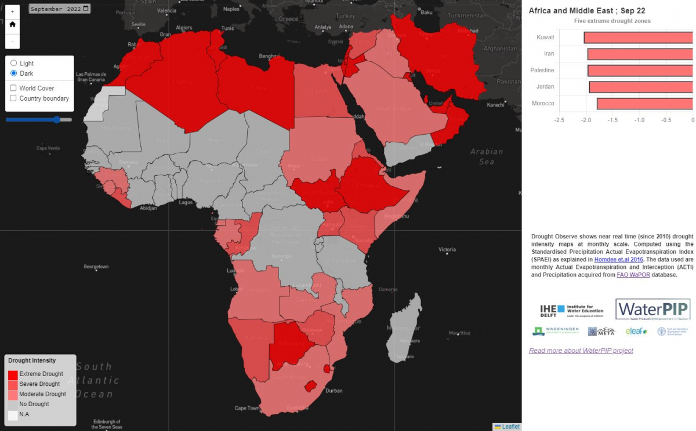
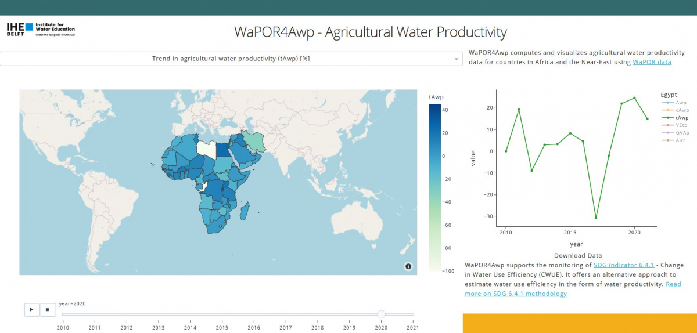

# Dashboards
Welcome to IHE Delft Water Accounting team's dashboard overview. Since 2020, IHE Delft has been working on utilising WaPOR data to support agricultural and water management. Various results and products are presented in dashboards. This webpages provides an overview of a number of these dashboards.

for more information contact wateraccounting_project@un-ihe.org or check wateraccounting.un-ihe.org

## Irrigation Performance Assessment
Irrigation performance assessments were implemented in three countries, Kenya, Sudan and Egypt (more countries ongoing). These dashboards utilise a standardised python script and StreamLit dashboard execution. 

[![Button]][Link4]

## Drought Observe
DroughtObserve is a dashboard developed under the WaterPIP project that monitors and forecasts drought at national and sub-national level using FAO WaPOR data. More information [here](https://github.com/wateraccounting/droughtobserve)

[![Button]][Link1]

## WaPOR4Awp - Agricultural Water Productivity
A dashboard that calculates agricultural water productivity over irrigated crop land as an alternative for estimating agricultural water use efficiency which is part of the reporting on SDG 6.4.1 Change in water use efficiency. More information [here](https://github.com/wateraccounting/wapor4awp)

[![Button]][Link2]

[Link2]: https://wapor4awp.org
[Link1]: https://wateraccounting.github.io/droughtobserve/
[Button]: https://img.shields.io/badge/View_Dashboard!-37a779?style=for-the-badge
[Link4]: https://mwea-ipa.streamlit.app/
