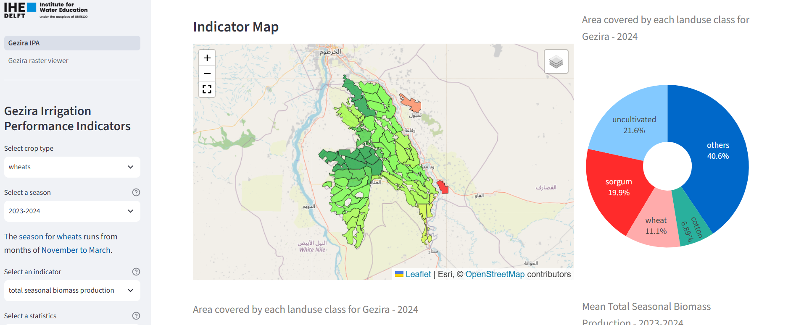
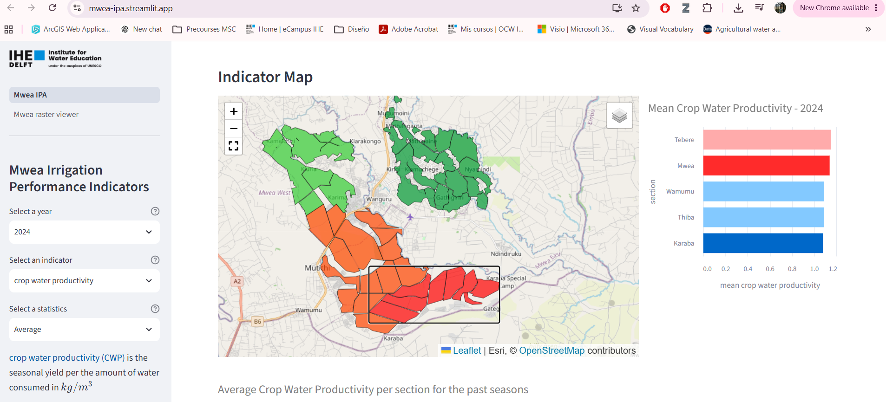
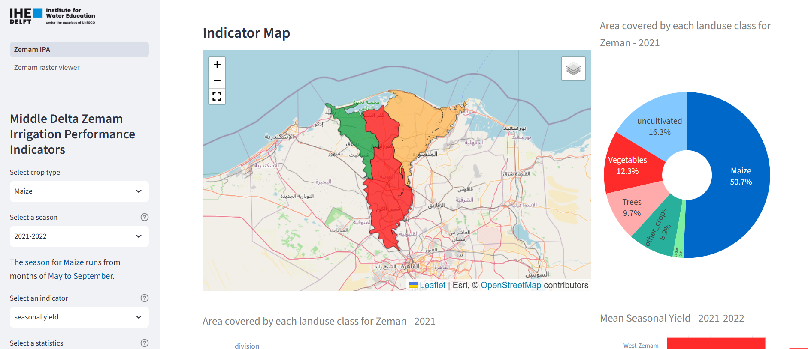
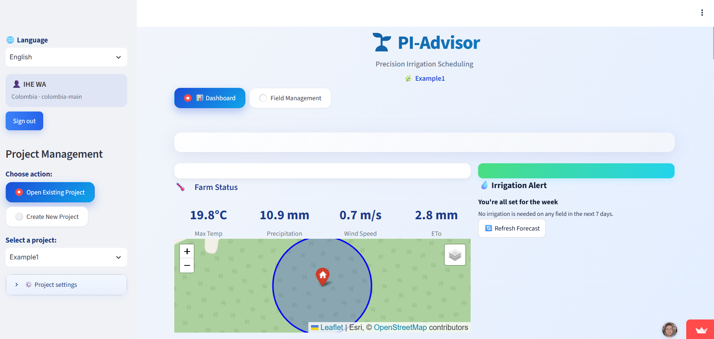
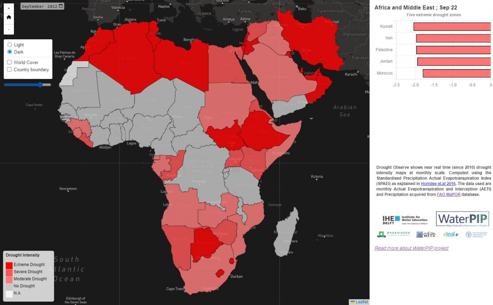
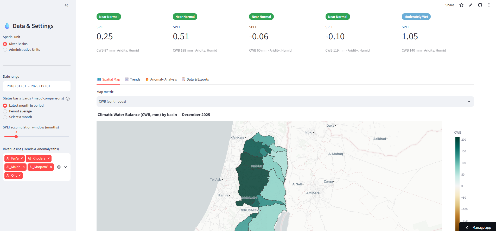
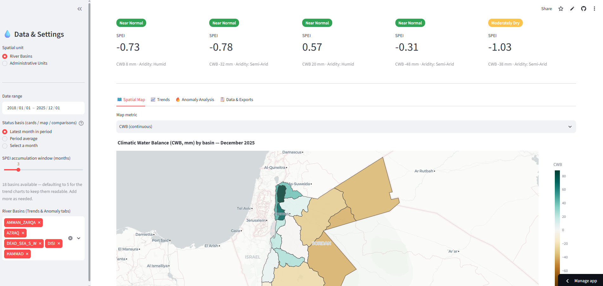
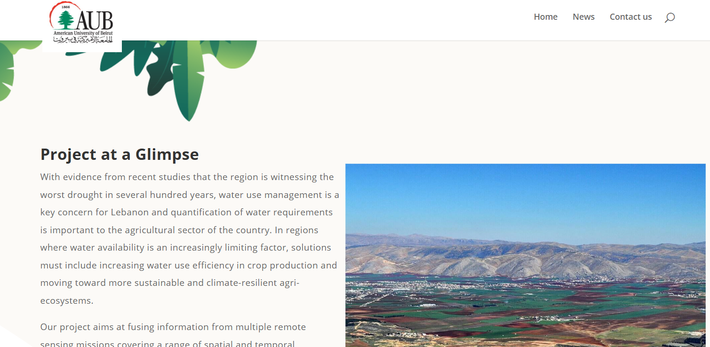

# Dashboards
Welcome to IHE Delft Water Accounting team's dashboard overview. Since 2020, IHE Delft has been working on utilising WaPOR data to support agricultural and water management. Various results and products are presented in dashboards. This webpages provides an overview of a number of these dashboards.

for more information contact wateraccounting_project@un-ihe.org or check our [website](https://wateraccounting.un-ihe.org)

# Co-developed water management tools using WaPOR data

*FAO WaPOR · Country activities*

WaPOR supports countries in co-developing practical digital tools that turn satellite-based water data into actionable information: irrigation performance, irrigation scheduling, drought monitoring, water accounting and groundwater management.

Each tool is designed jointly with ministries, water authorities, research institutes and local partners, which is what makes long-term ownership and uptake possible.

[![Open the FAO tools page][FAO]](https://www.fao.org/in-action/remote-sensing-for-water-productivity/country-activities/tools-in-co-development/en)

*Tools are being co-developed across the 10 WaPOR partner countries.*

## In this page

1. [Irrigation performance](#1-irrigation-performance-tools)
2. [Irrigation scheduling](#2-irrigation-scheduling-tools)
3. [Drought monitoring](#3-drought-monitoring-tools)
4. [National water information systems](#4-wapor-data-in-national-water-information-systems)
5. [Groundwater abstraction](#5-groundwater-abstraction-tools)
6. [Applications and web tools](#6-applications-story-maps-and-web-tools)

---

## 1. Irrigation performance tools

These tools analyse how effectively and equitably irrigation water is used. They deliver indicators such as water productivity, adequacy, equity and crop water deficit, so managers can improve irrigation service delivery.

 <b>Sudan</b> · Gezira irrigation performance dashboard (GIS-IPA-DS)

Leaflet and Streamlit dashboard with performance indicators per irrigation block and main crop, for winter and summer seasons, built on WaPOR Level 2 data.

**Partners:** Ministry of Irrigation and Water Resources, Hydraulic Research Center and Gezira Scheme Management, with IHE Delft and IWMI.

**Scheme:** Gezira, ~890 000 ha and 4 300 km of canals, Africa's largest.

[![Button]](https://gezira-sudan-ipa.streamlit.app/)

 <b>Kenya</b> · Performance of irrigation assessment tool (PIA)

Dashboards with optimal irrigation plans, crop water productivity indicators and downloadable reports. WaPOR 20 m data are combined with in situ soil moisture sensors.

**Partners:** National Irrigation Authority, Ministry of Water, Sanitation and Irrigation, JKUAT, FAO Kenya and IHE Delft.

**Schemes:** Mwea, Tana and Bura, over 29 000 acres.

[![Button]](https://mwea-ipa.streamlit.app/)

 <b>Egypt</b> · Irrigation assessment tool for Egypt (IPAT)

![Operational pilot][OperationalPilot]

Web tool hosted by the Ministry of Water Resources and Irrigation. It analyses water use and locates high and low productivity areas using WaPOR v3 Level 3 (20 m) data.

**Partners:** Ministry of Water Resources and Irrigation, scheme managers, policy makers and IWMI, with IHE Delft and FAO.

**Area:** Middle and West Delta, ~1.5 million ha, three irrigation systems.

[![Button]](https://zemamipa.streamlit.app/)

---

## 2. Irrigation scheduling tools

These tools turn WaPOR evapotranspiration and biomass into practical advice for farmers and irrigation managers: how much water the crop needs, and when to apply it.

 <b>Colombia</b> · Irrigation assessment tool (IPA)

![Under development][UnderDev]

Dashboard combining irrigation performance and scheduling metrics. It joins ASBAMA local datasets with WaPOR Level 3 data to map water use, irrigation efficiency, crop water deficit and scheduling needs.

**Partners:** Ministry of Agriculture of Colombia, ASBAMA, the Río Frío, Sevilla, Tucurinca and Aracataca irrigation districts, and IWMI.

**Area:** Magdalena department, ~84 000 ha, around 900 000 t of bananas a year.

[![Button]](https://pi-advisor-v02-viewer.streamlit.app/?lang=en)

---

## 3. Global monitoring tools

These tools track agricultural drought, vegetation stress and water deficits over time, with spatially explicit indices and, in some cases, early warning information.

<b>Web map · Africa</b> · Drought Observe

A drought monitoring system from the WaterPIP project, with near real-time drought intensity maps for Africa at 250 m and monthly steps, piloted in Kenya, Ethiopia and Mozambique.

**Method:** SPAEI from long-term dekadal water surplus and deficit (P − RET) fitted to a log-logistic distribution, then a decision-tree model regressing SPAEI against WaPOR phenology, land cover, precipitation, NDVI and temperature. Runs in Google Earth Engine.

[![Button]](https://waterpiporg.users.earthengine.app/view/dms)

---

## 4. WaPOR data in national water information systems

Here WaPOR data are embedded directly into existing institutional platforms, so ministries and water authorities can monitor irrigation, water use and water budgets as part of their routine work.

 <b>Palestine</b> · WaPOR in the national water information system (WaPOR-NWIS)

Integration of WaPOR data with the digital National Water Information System to improve water budget reporting, agricultural water use monitoring, domestic supply planning and allocation.

**Partners:** Water Authority, Ministry of Agriculture, technical teams and FAO, with IHE Delft.

[![Button]][fao-palestine]

 <b>Jordan</b> · WaPOR in the national water information system (WaPOR-NWIS)

Integration of WaPOR data with Jordan's digital National Water Information System to strengthen water budget reporting and support decisions on allocation, irrigation efficiency and sustainable use.

**Partners:** Ministry of Water and Irrigation, Jordan Valley Authority, University of Jordan and FAO, with IHE Delft and IWMI.

[![Button]][fao-jordan]

---

## 5. Groundwater abstraction tools

These tools estimate groundwater consumption and compare abstraction against crop water requirements, helping institutions spot over-abstraction and assess risks to aquifer sustainability.

 <b>Palestine</b> · Groundwater abstraction monitoring tool (GAM)

![Planned][Planned]

Will track groundwater extraction against crop water requirements, assess cropping patterns and monitor water use in a region that depends entirely on groundwater, with about 166 mm of rainfall a year.

**Partners:** Water Authority and Ministry of Agriculture, with IWMI and FAO.

**Area:** Jericho, southern Jordan Valley: date palm and vegetables.

[![Button]][fao-palestine]

 <b>Jordan</b> · Groundwater abstraction monitoring tool (GAM)

![Design phase][DesignPhase]

Will estimate water consumption in millimetres and cubic metres at farm and area level, and compare it with abstracted groundwater to support sustainable management.

**Partners:** Ministry of Water and Irrigation, Jordan Water Authority and University of Jordan, with IWMI.

**Area:** Jafer, southern Jordan, under 50 mm of rainfall a year.

[![Button]][fao-jordan]

---

## 6. Applications, story maps and web tools

Beyond the tools co-developed with national institutions, WaPOR data feed a wider set of applications built by universities, projects and hackathon teams. Use these as inspiration for your own work.

<b>Story map · Sudan</b> · Cultivated cropland extent in Sudan

An ArcGIS StoryMaps example covering July to September 2023, showing how WaPOR data can be turned into a narrative map for a wider audience.

[![Button]](https://storymaps.arcgis.com/stories/6a54ed0c923d489e91b318fee15b8cf9)

<b>Video</b> · Bringing WaPOR data to the field with QGIS and Mergin Maps

How to take WaPOR layers from the desktop to field data collection on a mobile device.

[![Watch on YouTube][Watch]](https://www.youtube.com/watch?v=fm3ltKHz-dk)

<b>Video · Hackathon 2020</b> · PlantVillage and the WaPOR database

The PlantVillage presentation from the 2020 WaPOR Hackathon, a good example of what a hackathon team can build with the database.

[![Watch on YouTube][Watch]](https://www.youtube.com/watch?v=tQtca4a4X8A)

<b>Project · Lebanon</b> · Time-series ET mapping for irrigation management (ITSET)

ITSET fuses several remote sensing missions across different spatial and temporal resolutions to map daily water use, vegetation indices and, eventually, yield and water productivity at field scale. Outputs are delivered through an online platform and a smartphone app. The project is ongoing.

[![Button]](https://sites.aub.edu.lb/etmap/)

<b>Impact story · Kenya</b> · More crops per drop for food security

A geostory from the IHE Delft Water and Development Partnership Programme repository, on the application of digital innovations in the Galana Kulalu Irrigation Scheme, Kenya. It shows how remote sensing and digital tools translate into on-the-ground irrigation decisions.

[![Button]](https://wdpprepository.org/catalogue/#/geostory/255)

---

> **Source:** FAO WaPOR, [Tools in co-development](https://www.fao.org/in-action/remote-sensing-for-water-productivity/country-activities/tools-in-co-development/en). Content summarised for teaching purposes; check the FAO page for the current status of each tool. The card thumbnails are illustrative raster patterns, not outputs of the tools themselves.

<!-- ========== BUTTONS AND STATUS BADGES ========== -->
[FAO]: https://img.shields.io/badge/Open_the_FAO_tools_page-F2C14E?style=for-the-badge
[Watch]: https://img.shields.io/badge/Watch_on_YouTube-C9A227?style=for-the-badge
[OperationalPilot]: https://img.shields.io/badge/Operational_pilot-1e6b4c?style=flat-square
[UnderDev]: https://img.shields.io/badge/Under_development-96602a?style=flat-square
[Planned]: https://img.shields.io/badge/Planned-4a5d74?style=flat-square
[DesignPhase]: https://img.shields.io/badge/Design_phase-4a5d74?style=flat-square
[Button]: https://img.shields.io/badge/Open_the_tool-17607A?style=for-the-badge
[FAOCountry]: https://img.shields.io/badge/Open_the_FAO_country_page-17607A?style=for-the-badge

<!-- ========== FAO COUNTRY PAGES ========== -->
[fao-jordan]: https://www.fao.org/in-action/remote-sensing-for-water-productivity/country-activities/jordan/en
[fao-palestine]: https://www.fao.org/in-action/remote-sensing-for-water-productivity/country-activities/palestine/en