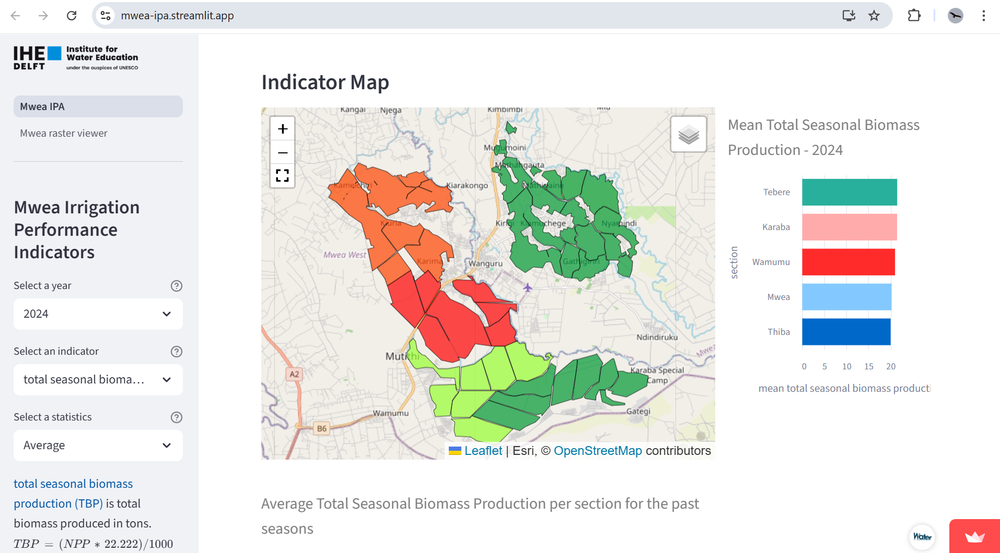
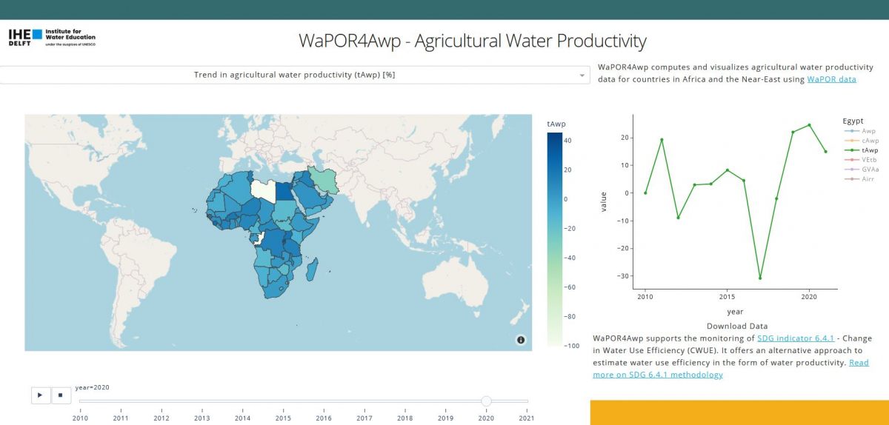
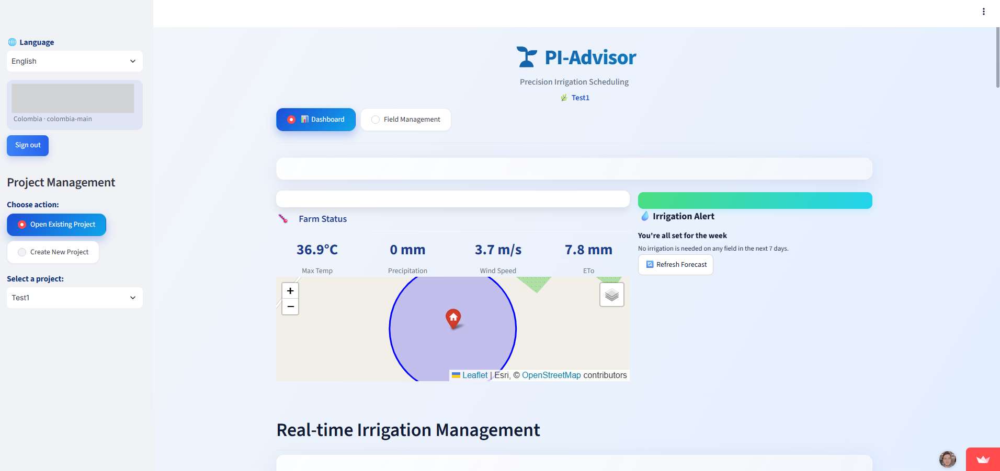
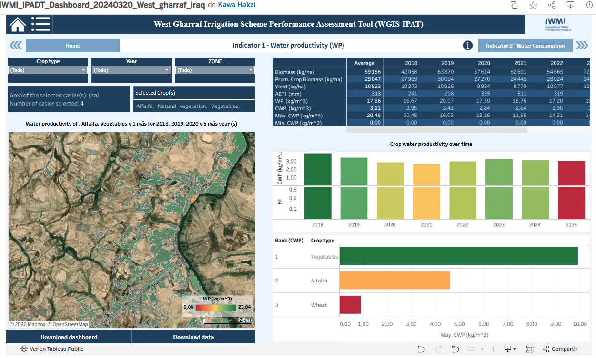
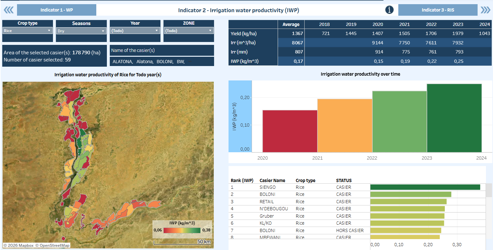
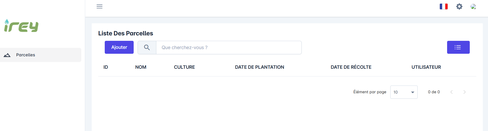
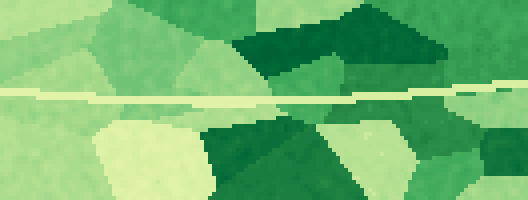
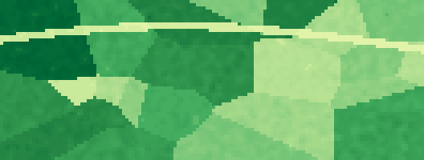
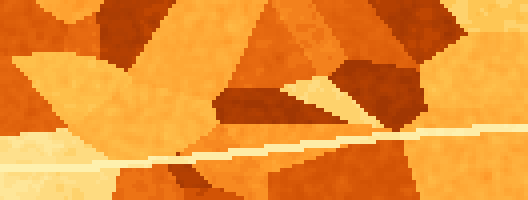
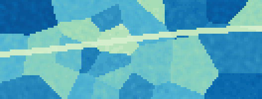

# Dashboards
Welcome to IHE Delft Water Accounting team's dashboard overview. Since 2020, IHE Delft has been working on utilising WaPOR data to support agricultural and water management. Various results and products are presented in dashboards. This webpages provides an overview of a number of these dashboards.

for more information contact wateraccounting_project@un-ihe.org or check our [website](wateraccounting.un-ihe.org)

## Irrigation Performance Assessment
Irrigation performance assessments were implemented in three countries, Kenya, Sudan and Egypt (more countries ongoing). These dashboards utilise a standardised python script and StreamLit dashboard execution. 

[![Button]][Link4]

[IPA Dashboard Gezira, Sudan](https://gezira-sudan-ipa.streamlit.app/)

[IPA Dashboard Mwea, Kenya](https://mwea-ipa.streamlit.app/)

[IPA Dashboard Meat Yazid](https://zemam-egypt-ipa.streamlit.app/)

## Drought Observe
DroughtObserve is a dashboard developed under the WaterPIP project that monitors and forecasts drought at national and sub-national level using FAO WaPOR data. More information [here](https://github.com/wateraccounting/droughtobserve)

[![Button]][Link1]

## WaPOR4Awp - Agricultural Water Productivity
A dashboard that calculates agricultural water productivity over irrigated crop land as an alternative for estimating agricultural water use efficiency which is part of the reporting on SDG 6.4.1 Change in water use efficiency. More information [here](https://github.com/wateraccounting/wapor4awp)

[![Button]][Link2]

[Link2]: https://wapor4awp.org
[Link1]: https://wateraccounting.github.io/droughtobserve/
[Button]: https://img.shields.io/badge/View_Dashboard!-37a779?style=for-the-badge
[Link4]: https://mwea-ipa.streamlit.app/

## PI-Advisor
PI-Advisor is currently under construction. At this moment, it is available as a viewer for the Kenya case.

[![Button]][Link5]

[PI-Advisor Viewer - Kenya Case](https://pi-advisor-v02-viewer.streamlit.app/)

[Link5]: https://pi-advisor-v02-viewer.streamlit.app/

# Co-developed water management tools using WaPOR data

*FAO WaPOR · Country activities*

WaPOR supports countries in co-developing practical digital tools that turn satellite-based water data into actionable information: irrigation performance, irrigation scheduling, drought monitoring, water accounting and groundwater management.

Each tool is designed jointly with ministries, water authorities, research institutes and local partners, which is what makes long-term ownership and uptake possible.

[![Open the FAO tools page][FAO]](https://www.fao.org/in-action/remote-sensing-for-water-productivity/country-activities/tools-in-co-development/en)

*Tools are being co-developed across the 10 WaPOR partner countries.*

## In this page

1. [Irrigation performance](#1-irrigation-performance-tools)
2. [Irrigation scheduling](#2-irrigation-scheduling-tools)
3. [Drought monitoring](#3-drought-monitoring-tools)
4. [Water accounting](#4-water-accounting-tools)
5. [National water information systems](#5-wapor-data-in-national-water-information-systems)
6. [Groundwater abstraction](#6-groundwater-abstraction-tools)
7. [Applications and web tools](#7-applications-story-maps-and-web-tools)

---

## 1. Irrigation performance tools

These tools analyse how effectively and equitably irrigation water is used. They deliver indicators such as water productivity, adequacy, equity and crop water deficit, so managers can improve irrigation service delivery.

 <b>Iraq</b> · West-Gharraf irrigation performance monitoring (WGIS)

Tableau dashboard linked to national platforms. Shows water productivity, relative irrigation supply, crop water deficit, irrigation equity and possible illegal abstraction, as graphs and maps.

**Partners:** Ministry of Water Resources of Iraq and IWMI, with the Ministries of Agriculture, Environment, Planning and Higher Education.

**Scheme:** Wasit and Dhi Qar governorates, ~95 000 ha, 96% grain crops.

[![Open the tool page][Open]](https://public.tableau.com/app/profile/kamal.hakzi/viz/IWMI_IPADT_Dashboard_20240320_17697207426210/Overview)

 <b>Mali</b> · Irrigation performance tool of Office du Niger (IPON)

![Handed over][HandedOver]

Dashboard with 11 irrigation performance indicators, including water consumption, water productivity, equity, adequacy and uniformity, shown as graphs, maps and tables.

**Partners:** Office du Niger, Malian Ministry of Agriculture and IWMI.

**Scheme:** Office du Niger near Ségou, rice and sugarcane.

[![Open the tool page][Open]](https://public.tableau.com/app/profile/water.eleaf/viz/IWMI_IPADT_Dashboard_20240320/Overview)

 <b>Sudan</b> · Gezira irrigation performance dashboard (GIS-IPA-DS)

Leaflet and Streamlit dashboard with performance indicators per irrigation block and main crop, for winter and summer seasons, built on WaPOR Level 2 data.

**Partners:** Ministry of Irrigation and Water Resources, Hydraulic Research Center and Gezira Scheme Management, with IHE Delft and IWMI.

**Scheme:** Gezira, ~890 000 ha and 4 300 km of canals, Africa's largest.

[![Open the tool page][Open]](https://gezira-sudan-ipa.streamlit.app/)

 <b>Jordan</b> · Irrigation water performance assessment tool (IWPAT)

Web portal inside the Jordan Valley Authority water information system, with water use statistics, hybrid efficiency indicators and seasonal crop water use at district and farm level.

**Area:** Northern Jordan Valley: citrus, vegetables and dates under piped surface irrigation.

[![Open the tool page][Open]][fao-jordan]

 <b>Kenya</b> · Performance of irrigation assessment tool (PIA)

Dashboards with optimal irrigation plans, crop water productivity indicators and downloadable reports. WaPOR 20 m data are combined with in situ soil moisture sensors.

**Partners:** National Irrigation Authority, Ministry of Water, Sanitation and Irrigation, JKUAT, FAO Kenya and IHE Delft.

**Schemes:** Mwea, Tana and Bura, over 29 000 acres.

[![Open the tool page][Open]](https://mwea-ipa.streamlit.app/)

 <b>Egypt</b> · Irrigation assessment tool for Egypt (IPAT)

![Operational pilot][OperationalPilot]

Web tool hosted by the Ministry of Water Resources and Irrigation. It analyses water use and locates high and low productivity areas using WaPOR v3 Level 3 (20 m) data.

**Partners:** Ministry of Water Resources and Irrigation, scheme managers, policy makers and IWMI, with IHE Delft and FAO.

**Area:** Middle and West Delta, ~1.5 million ha, three irrigation systems.

[![Open the tool page][Open]](https://zemamipa.streamlit.app/)

 <b>Mozambique</b> · Chókwè irrigation performance dashboard

![Pilot][Pilot]

Tableau dashboard for the Lower Limpopo schemes, with water use statistics and hybrid indicators that combine WaPOR data with water supply information at block level.

**Partners:** National Institute for Irrigation, Ministry of Agriculture and Rural Development, Lower Limpopo Basin Authority, Hidráulica de Chókwè EP and IWMI.

**Area:** Chókwè and Xai-Xai, over 90 000 ha.

[![Open the tool page][Open]](https://public.tableau.com/app/profile/charama/viz/IrrigationPerformanceAssessmentToolIPAT/SchemeEN)

---

## 2. Irrigation scheduling tools

These tools turn WaPOR evapotranspiration and biomass into practical advice for farmers and irrigation managers: how much water the crop needs, and when to apply it.

 <b>Tunisia</b> · Irrigation Reference to Enhance Yield (IREY)

![Mobile app on Google Play][MobileApp]

Real-time irrigation scheduling, 10-day forecasts of soil moisture depletion and advice on irrigation timing.

**Partners:** Institut National des Grandes Cultures, Tunisian Ministry of Agriculture, Olive Institute and regional research centres.

**Scheme:** Bouheurtma, Jendouba, 13 500 ha, mainly wheat.

[![Open the tool page][Open]][fao-tunisia]

 <b>Palestine</b> · Irrigation advisory app

![Under development][UnderDev]

Mobile app that will give irrigation water requirements and irrigation duration by crop and variety, with a focus on date palm, and by irrigation system, farm size, pump type and soil.

**Partners:** Ministry of Agriculture and Snipe, a local IT company in Jericho, with IWMI and FAO.

**Area:** Jericho Governorate, about 99% of the land irrigated.

[![Open the tool page][Open]][fao-palestine]

 <b>Egypt</b> · Irrigation Water Information application (IRWI)

![Under development][UnderDev]

Mobile app for timing of water application, crop health monitoring and dynamic yield prediction for rice, cotton, soybean, maize and potatoes. It combines WaPOR RET, productivity and AETI with local soil and water data.

**Partners:** Soil, Water and Environment Research Institute, Farmer Field School facilitators and IWMI.

**Area:** Nile Delta and West Delta schemes.

[![Open the tool page][Open]][fao-egypt]

 <b>Colombia</b> · Irrigation assessment tool (IPA)

![Under development][UnderDev]

Dashboard combining irrigation performance and scheduling metrics. It joins ASBAMA local datasets with WaPOR Level 3 data to map water use, irrigation efficiency, crop water deficit and scheduling needs.

**Partners:** Ministry of Agriculture of Colombia, ASBAMA, the Río Frío, Sevilla, Tucurinca and Aracataca irrigation districts, and IWMI.

**Area:** Magdalena department, ~84 000 ha, around 900 000 t of bananas a year.

[![Open the tool page][Open]](https://pi-advisor-v02-viewer.streamlit.app/?lang=en)

---

## 3. Drought monitoring tools

These tools track agricultural drought, vegetation stress and water deficits over time, with spatially explicit indices and, in some cases, early warning information.

<b>Web map · Africa</b> · Drought Observe

A drought monitoring system from the WaterPIP project, with near real-time drought intensity maps for Africa at 250 m and monthly steps, piloted in Kenya, Ethiopia and Mozambique.

**Method:** SPAEI from long-term dekadal water surplus and deficit (P − RET) fitted to a log-logistic distribution, then a decision-tree model regressing SPAEI against WaPOR phenology, land cover, precipitation, NDVI and temperature. Runs in Google Earth Engine.

[![Open Drought Observe][Open]](https://waterpiporg.users.earthengine.app/view/dms)

 <b>Sudan</b> · Drought monitoring tool (DMT)

![Under development][UnderDev]

Python web dashboard with drought severity maps, ESI, SPEI and SPI indices, biomass and yield estimates and yield gap assessment. Uses WaPOR v3 Level 2 at 300 m, from dekadal to seasonal.

**Partners:** Sudan Meteorological Authority, Ministry of Agriculture and Forests, Civil Defence, Hydraulic Research Center and IWMI, with the CIMA Foundation.

**Coverage:** Gedarif State first, expandable to national scale.

[![Open the tool page][Open]][fao-sudan]

 <b>Pakistan</b> · Pakistan drought monitoring system (PakDMS)

Web dashboard with dekadal drought indices and near real-time alerts, built on WaPOR v3 evapotranspiration, soil moisture and net primary productivity at 100 m.

**Partners:** Pakistan Meteorological Department, National Disaster Risk Management Fund, Barani Agriculture Research Center, provincial irrigation and agriculture departments, and the NDMA, with IWMI.

**Coverage:** From coastal Sindh to Gilgit-Baltistan.

[![Open the tool page][Open]](https://pakdms.iwmi.org/)

---

## 4. Water accounting tools

These tools quantify water availability, use and consumption across agricultural systems or river basins, separating irrigated from rainfed agriculture and producing spatially explicit water balances.

 <b>Algeria</b> · Water use in Algerian irrigation schemes

![Under development][UnderDev]

Python tool with a dynamic dashboard for Ubuntu and Windows. Dekadal water use monitoring at parcel level, with deep learning for parcel identification and segmentation of irrigated versus rainfed plots.

**Partners:** WaPOR Digital Unit of the Department of Statistics and Strategies, Ministry of Agriculture, and IWMI, with FAO.

**Coverage:** Irrigation schemes nationwide.

[![Open the tool page][Open]][fao-algeria]

 <b>Tunisia</b> · Water use tool for irrigation schemes

![Under development][UnderDev]

Python tool with dynamic dashboard for dekadal water use at parcel level. It detects parcel boundaries, determines start and end of season, and separates irrigated from rainfed plots using cumulative rainfall and actual ET.

**Partners:** WaPOR Task Force, Ministry of Agriculture, and IWMI, with FAO.

**Coverage:** Irrigation schemes nationwide.

[![Open the tool page][Open]][fao-tunisia]

 <b>Kenya</b> · Water availability and demand tool (WAD Kenya)

Online dashboard for water availability and demand, cropland partitioning into rainfed and irrigated, storage suitability for surface structures and on-farm ponds, and groundwater availability.

**Partners:** National Irrigation Authority, Ministry of Agriculture, CETRAD, eleven county governments and IWMI, with KEWI.

**Coverage:** Eleven counties, about 300 000 ha of irrigated cropland.

[![Open the tool page][Open]](https://app.powerbi.com/view?r=eyJrIjoiOTljM2QwZTQtZmIzZi00NTliLWE2NTUtYzU4YjEyMTVlZDU4IiwidCI6IjZhZmEwZTAwLWZhMTQtNDBiNy04YTJlLTIyYTdmOGMzNTdkNSIsImMiOjh9)

---

## 5. WaPOR data in national water information systems

Here WaPOR data are embedded directly into existing institutional platforms, so ministries and water authorities can monitor irrigation, water use and water budgets as part of their routine work.

 <b>Ethiopia</b> · Irrigation management information system (IMISET)

National web platform that integrates WaPOR v3 data for monitoring and managing irrigation schemes, with performance tracking, water use monitoring and decision support.

**Partners:** Ministry of Agriculture, scheme managers, regional authorities and IHE Delft, with FAO.

**Coverage:** Several irrigation pilot areas across the country.

[![Open the tool page][Open]][fao-ethiopia]

 <b>Palestine</b> · WaPOR in the national water information system (WaPOR-NWIS)

Integration of WaPOR data with the digital National Water Information System to improve water budget reporting, agricultural water use monitoring, domestic supply planning and allocation.

**Partners:** Water Authority, Ministry of Agriculture, technical teams and FAO, with IHE Delft.

[![Open the tool page][Open]][fao-palestine]

 <b>Jordan</b> · WaPOR in the national water information system (WaPOR-NWIS)

Integration of WaPOR data with Jordan's digital National Water Information System to strengthen water budget reporting and support decisions on allocation, irrigation efficiency and sustainable use.

**Partners:** Ministry of Water and Irrigation, Jordan Valley Authority, University of Jordan and FAO, with IHE Delft and IWMI.

[![Open the tool page][Open]][fao-jordan]

---

## 6. Groundwater abstraction tools

These tools estimate groundwater consumption and compare abstraction against crop water requirements, helping institutions spot over-abstraction and assess risks to aquifer sustainability.

 <b>Palestine</b> · Groundwater abstraction monitoring tool (GAM)

![Planned][Planned]

Will track groundwater extraction against crop water requirements, assess cropping patterns and monitor water use in a region that depends entirely on groundwater, with about 166 mm of rainfall a year.

**Partners:** Water Authority and Ministry of Agriculture, with IWMI and FAO.

**Area:** Jericho, southern Jordan Valley: date palm and vegetables.

[![Open the tool page][Open]][fao-palestine]

 <b>Jordan</b> · Groundwater abstraction monitoring tool (GAM)

![Design phase][DesignPhase]

Will estimate water consumption in millimetres and cubic metres at farm and area level, and compare it with abstracted groundwater to support sustainable management.

**Partners:** Ministry of Water and Irrigation, Jordan Water Authority and University of Jordan, with IWMI.

**Area:** Jafer, southern Jordan, under 50 mm of rainfall a year.

[![Open the tool page][Open]][fao-jordan]

 <b>Iraq · Kurdistan</b> · GAM Kurdistan

Streamlit dashboard, usable from a smartphone, with abstraction rates, recharge and consumption area mapping, water stress indicators and field-level seasonal analysis. It combines WaPOR v3 at 20 m with the Thornthwaite–Mather water balance and helps detect unplanned extraction.

**Partners:** Ministry of Agriculture and Water Resources of the Kurdistan Region, Ministry of Water Resources, Ministry of Higher Education, universities, farmers and Water Users Associations, with IWMI.

**Area:** Shemamuk irrigation project, Erbil, ~15 000 ha.

[![Open the tool page][Open]](https://groundwater-dashboard.streamlit.app/)

---

## 7. Applications, story maps and web tools

Beyond the tools co-developed with national institutions, WaPOR data feed a wider set of applications built by universities, projects and hackathon teams. Use these as inspiration for your own work.

<b>Story map · Sudan</b> · Cultivated cropland extent in Sudan

An ArcGIS StoryMaps example covering July to September 2023, showing how WaPOR data can be turned into a narrative map for a wider audience.

[![Open the story map][Open]](https://storymaps.arcgis.com/stories/6a54ed0c923d489e91b318fee15b8cf9)

<b>Video</b> · Bringing WaPOR data to the field with QGIS and Mergin Maps

How to take WaPOR layers from the desktop to field data collection on a mobile device.

[![Watch on YouTube][Watch]](https://www.youtube.com/watch?v=fm3ltKHz-dk)

<b>Video · Hackathon 2020</b> · PlantVillage and the WaPOR database

The PlantVillage presentation from the 2020 WaPOR Hackathon, a good example of what a hackathon team can build with the database.

[![Watch on YouTube][Watch]](https://www.youtube.com/watch?v=tQtca4a4X8A)

<b>Project · Lebanon</b> · Time-series ET mapping for irrigation management (ITSET)

ITSET fuses several remote sensing missions across different spatial and temporal resolutions to map daily water use, vegetation indices and, eventually, yield and water productivity at field scale. Outputs are delivered through an online platform and a smartphone app. The project is ongoing.

[![Open the ITSET site][Open]](https://sites.aub.edu.lb/etmap/)

<b>Impact story · Kenya</b> · More crops per drop for food security

A geostory from the IHE Delft Water and Development Partnership Programme repository, on the application of digital innovations in the Galana Kulalu Irrigation Scheme, Kenya. It shows how remote sensing and digital tools translate into on-the-ground irrigation decisions.

[![Open the geostory][Open]](https://wdpprepository.org/catalogue/#/geostory/255)

---

> **Source:** FAO WaPOR, [Tools in co-development](https://www.fao.org/in-action/remote-sensing-for-water-productivity/country-activities/tools-in-co-development/en). Content summarised for teaching purposes; check the FAO page for the current status of each tool. The card thumbnails are illustrative raster patterns, not outputs of the tools themselves.

<!-- ========== BUTTONS AND STATUS BADGES ========== -->
[FAO]: https://img.shields.io/badge/Open_the_FAO_tools_page_→-F2C14E?style=for-the-badge
[Open]: https://img.shields.io/badge/Open_→-37a779?style=for-the-badge
[Watch]: https://img.shields.io/badge/▶_Watch_on_YouTube-C9A227?style=for-the-badge
[HandedOver]: https://img.shields.io/badge/Handed_over-1e6b4c?style=flat-square
[OperationalPilot]: https://img.shields.io/badge/Operational_pilot-1e6b4c?style=flat-square
[MobileApp]: https://img.shields.io/badge/Mobile_app-Google_Play-1e6b4c?style=flat-square
[Pilot]: https://img.shields.io/badge/Pilot-96602a?style=flat-square
[UnderDev]: https://img.shields.io/badge/Under_development-96602a?style=flat-square
[Planned]: https://img.shields.io/badge/Planned-4a5d74?style=flat-square
[DesignPhase]: https://img.shields.io/badge/Design_phase-4a5d74?style=flat-square

<!-- ========== FAO COUNTRY PAGES ========== -->
[fao-algeria]: https://www.fao.org/in-action/remote-sensing-for-water-productivity/country-activities/algeria/en
[fao-egypt]: https://www.fao.org/in-action/remote-sensing-for-water-productivity/country-activities/egypt/en
[fao-ethiopia]: https://www.fao.org/in-action/remote-sensing-for-water-productivity/country-activities/ethiopia/en
[fao-jordan]: https://www.fao.org/in-action/remote-sensing-for-water-productivity/country-activities/jordan/en
[fao-palestine]: https://www.fao.org/in-action/remote-sensing-for-water-productivity/country-activities/palestine/en
[fao-sudan]: https://www.fao.org/in-action/remote-sensing-for-water-productivity/country-activities/sudan/en
[fao-tunisia]: https://www.fao.org/in-action/remote-sensing-for-water-productivity/country-activities/tunisia/en

<!-- ========== IMAGES TO UPLOAD TO THE img/ FOLDER ==========
Rename the Moodle images as follows before uploading:

  iraq (1).png        -> img/iraq.png
  mali.png            -> img/mali.png
  sudan.png           -> img/sudan.png
  blobid3 (1).png     -> img/jordan-iwpat.png
  kenya.png           -> img/kenya.png
  egypt.png           -> img/egypt.png
  Moza.png            -> img/mozambique.png
  tunisia.png         -> img/tunisia.png
  blobid9 (1).png     -> img/palestine-advisory.png
  blobid10 (1).png    -> img/egypt-irwi.png
  Colombia.png        -> img/colombia.png
  Droughts.png        -> img/drought-observe.png
  blobid13 (1).png    -> img/sudan-dmt.png
  Pakistan.png        -> img/pakistan.png
  blobid15 (1).png    -> img/algeria.png
  blobid16 (1).png    -> img/tunisia-water-use.png
  kenyawater.png      -> img/kenya-wad.png
  ethipia.png         -> img/ethiopia.png
  blobid19 (1).png    -> img/palestine-nwis.png
  blobid20 (1).png    -> img/jordan-nwis.png
  blobid21 (1).png    -> img/palestine-gam.png
  blobid22 (1).png    -> img/jordan-gam.png
  iraq_gw.png         -> img/iraq-gam.png
  sudan3.png          -> img/sudan-storymap.png
  lebanon.png         -> img/lebanon.png
  kenya crops.png     -> img/kenya-crops.png
============================================================ -->